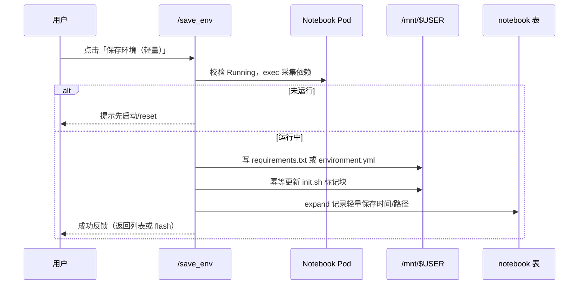
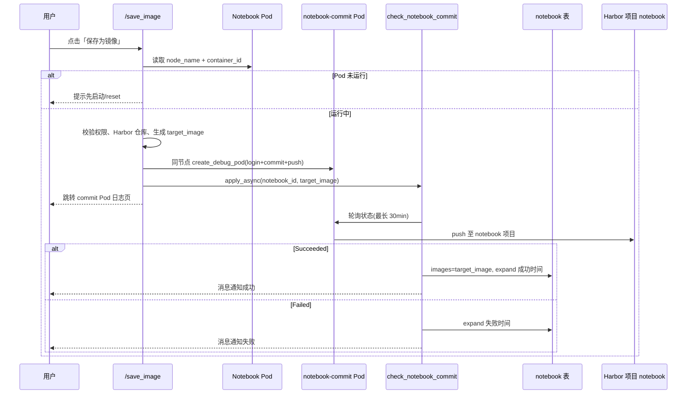

# Notebook 环境保存功能实现方案

## 背景与目标

平台 Notebook（`/notebook_modelview/api/`）运行在 K8s Pod 中，环境主要来自基础镜像与用户工作目录。用户在 Notebook 中通过 `pip` / `apt` / `conda` 安装的依赖写在容器可写层，**Pod 重建后会丢失**。

当前能力现状：

| 能力                | 状态                                                                                   |
| ------------------- | -------------------------------------------------------------------------------------- |
| UI「环境保存」列    | `model_notebook.Notebook.save` 仅展示「环境保存(企业版)」占位，无链接、无接口        |
| 异步结果处理        | `task.check_notebook_commit` 已实现，可更新 `notebook.images` 与 `expand` 时间戳 |
| 停止时清理          | `stop` 会删除 `notebook-commit-{user}-{id}` Pod                                    |
| Docker 在线调试保存 | `/docker_modelview/api/save/<id>` 完整可用，可作为镜像保存参考实现                   |
| 轻量恢复            | 文档推荐用户手动维护`/mnt/$USERNAME/init.sh`，平台无一键导出                         |

目标：同时提供两种保存能力，**列表以轻量保存为主入口、镜像保存为次要入口**，覆盖日常装包与重依赖/复杂配置两类场景，避免人人 commit 镜像导致仓库膨胀。

| 方式                       | 定位         | 固化内容                                                 |
| -------------------------- | ------------ | -------------------------------------------------------- |
| **保存环境（轻量）** | 默认、主入口 | `pip` / `conda` 依赖清单 + 写入 PVC 上的 `init.sh` |
| **保存为镜像**       | 次要入口     | 运行中容器 commit + push 至自建 Harbor 项目 `notebook`，更新`notebook.images` |

## 范围

### 包含

- 去掉企业版占位，列表提供两个入口：主按钮「保存环境（轻量）」、次要入口「保存为镜像」。
- 轻量保存 API：采集依赖、写入 requirements / environment.yml，幂等更新 `init.sh` 标记块。
- 镜像保存 API：对齐 Docker 模块，对运行中容器 commit + push，复用 `check_notebook_commit`。
- 推送目标统一为**自建 Harbor** 项目 `notebook`；目标镜像命名、仓库鉴权、权限校验、并发与失败处理。
- 配置项与操作文档同步。

### 不包含

- 不改造 JupyterLab / VSCode 内部 UI。
- 不新增独立前端页面；继续走 ADUGTemplate 列表 Markup。
- 不做镜像 GC、跨集群同步；Harbor 侧仓库生命周期（垃圾回收、保留策略）由运维在 Harbor 管理。
- 不做成 Pipeline Job Template。
- 不支持已停止 / 未运行 Notebook 的保存。
- 不对用户展示体积、配额类提示或警告文案。

## 方案选择

**采用双档并存，且以轻量为主入口：**

- 日常 Python 依赖 → 轻量保存（写 PVC，不推仓库）。
- 系统库、驱动、多软件混装、复杂 runtime → 镜像保存。

两种能力**同期交付**，无分期。入口通过主/次按钮引导使用习惯，不在 UI 中附加说明或警告。

## 入口与 UI

改造 `myapp/models/model_notebook.py` 中原 `save` 列（或拆为两列 / 同一单元格双链接）：

```html
<a href="/notebook_modelview/api/save_env/<id)">保存环境（轻量）</a>
<br>
<a href="/notebook_modelview/api/save_image/<id)">保存为镜像</a>
```

约定：

- **主入口**：「保存环境（轻量）」排在前面，视觉权重更高（默认样式链接）。
- **次要入口**：「保存为镜像」排在后面，可用次要样式（如小号或灰色文字），**不增加**体积、配额、适用场景等文案。
- 状态可基于 `expand` 展示最近一次轻量/镜像保存时间（仅状态，非警告）。

前端无独立页面；ADUGTemplate 渲染该列 Markup 即可。

## 现状对齐要点

### 可复用资产

```
myapp/views/view_docker.py          # save()：完整 commit/push 流程
myapp/tasks/async_task.py           # check_notebook_commit 已就绪
myapp/models/model_notebook.py      # save 属性改为双入口
myapp/views/view_notebook.py        # stop 时已清理 notebook-commit-* Pod；启动已执行 init.sh
```

### 与 Docker 保存的差异（镜像档）

| 项           | Docker                        | Notebook 镜像保存                               |
| ------------ | ----------------------------- | ----------------------------------------------- |
| 运行 Pod     | `docker-{user}-{id}`        | Notebook 实际 Pod 名                            |
| Commit Pod   | `docker-commit-{user}-{id}` | `notebook-commit-{user}-{id}`                 |
| 推送仓库     | 用户配置的 `target_image` 仓库 | **固定**自建 Harbor 项目 `notebook`           |
| 目标镜像字段 | 表字段`target_image`        | 规则生成或`?target_image=`（须落在 `notebook` 项目），可写入 `expand` |
| 成功回写     | `last_image = target_image` | `images = target_image`                       |
| 成功反馈     | DB 更新                       | DB +`push_message` + `expand` 时间戳        |

## 总体架构

### 轻量保存



### 镜像保存



## 方式一：保存环境（轻量）

### API

```text
GET|POST /notebook_modelview/api/save_env/<notebook_id>
```

权限：与现有 Notebook 操作一致（创建者 / 编辑权限 / 管理员）。

前置校验：

1. Notebook 记录存在。
2. 对应 Pod Running，可 exec。
3. 可做短时防重复点击。

### 采集与落盘

1. 对 Running Pod 执行 `kubectl exec`（或现有 K8s 封装）：
   - 探测 `conda` 是否可用；可用则 `conda env export --no-builds`（或当前激活 env）。
   - 否则对当前 Python 环境执行 `pip freeze`。
2. 写入 PVC：
   - `/mnt/{username}/notebooks/{notebook_name}/requirements.txt` 或 `environment.yml`
3. 幂等更新 `/mnt/{username}/init.sh` 中由平台管理的标记块：

```bash
# >>> notebook-env-save:{notebook_id} >>>
# managed by platform; do not edit this block manually
pip install -r /mnt/{username}/notebooks/{notebook_name}/requirements.txt || true
# <<< notebook-env-save:{notebook_id} <<<
```

若为 conda 导出，标记块改为对应的 `conda env update -f ...`（或项目约定的安装命令）。同一 `notebook_id` 再次保存时**替换**该标记块，不追加重复块。

4. 更新 `expand`：`save_env_success_last_time`、`save_env_path` 等。
5. 响应：flash 成功并返回 Notebook 列表（或 JSON 结果，与项目 API 风格一致）。

### 运行语义

- Notebook 启动已包含：`(nohup sh /mnt/$USER/init.sh > /init.log 2>&1 &)`，故 **reset / 重建后自动安装**。
- **不修改** `notebook.images`。
- 不覆盖用户手写的 `init.sh` 其他内容；仅维护标记块区间。

### 能力边界

- 覆盖 pip / conda 声明式依赖；不覆盖 apt、驱动、系统路径等变更（此类走镜像保存）。
- 私有源、需认证的包，由用户自行在 `init.sh` 标记块外补充。

## 方式二：保存为镜像

### API

```text
GET|POST /notebook_modelview/api/save_image/<notebook_id>
```

权限同轻量保存。

前置校验：

1. Notebook 存在。
2. Pod Running，可解析 `node_name` 与 `container_id`（剥离 `docker://` / `containerd://`）。
3. 处理并发：同名 `notebook-commit-*` 已在 Running 则拒绝或先删再建。
4. 目标镜像落在 Harbor `notebook` 项目；对应 `Repository` 存在（`server in target_image`，优先当前用户仓库），否则跳转仓库配置页。

### 目标镜像仓库（Harbor）

保存为镜像时，**统一推送到自建 Harbor**，与平台基础镜像所在项目分离：

| 项 | 约定 |
| -- | ---- |
| Harbor 地址 | `10.121.177.20:8082`（与 `HARBOR_REGISTRY` / 现网一致） |
| Harbor 项目 | `notebook`（**已新建、私有、项目管理员可推送**） |
| 与 `mlops` 项目关系 | `mlops` 继续承载平台基础/运行镜像；用户环境快照**只进** `notebook` |
| 仓库鉴权 | 平台「镜像仓库」中配置 `Repository.server=10.121.177.20:8082/notebook`（或至少能匹配此前缀），账号需对该 Harbor 项目具备推送权限 |
| 拉取 | 保存成功后 `notebook.images` 指向该地址；集群侧靠现有 `HUBSECRET` / 用户 hubsecret 拉镜像 |

Harbor 侧首次 push 时可按仓库策略自动创建 repository；无需预先为每个用户建空仓库。访问级别保持**私有**。

### 目标镜像命名

Notebook 表无 `target_image` 字段。采用规则生成，允许 `?target_image=` 覆盖，但**覆盖后仍须落在 Harbor `notebook` 项目前缀下**：

```text
{HARBOR_REGISTRY}/notebook/{username}/{notebook_name}:{yyyyMMddHHmmss}
```

示例：

```text
10.121.177.20:8082/notebook/zhangjm01/my-nb:20260714183000
```

约定细则：

- 默认前缀取 `NOTEBOOK_SAVE_IMAGE_PREFIX`（建议 `10.121.177.20:8082/notebook/`），**不再默认走** `REPOSITORY_ORG` / 腾讯云等公有仓。
- 镜像路径：`{username}/{notebook_name}`，便于在 Harbor 项目内按用户浏览；`notebook_name` 做安全清洗（小写、`[a-z0-9._-]`、长度截断）。
- `?target_image=` 若给出，须以 `NOTEBOOK_SAVE_IMAGE_PREFIX` 开头，否则拒绝，防止推到其他 Harbor 项目或外仓。
- 写入 `expand.save_target_image` 便于审计。

### Commit Pod 行为

对齐 `view_docker.save`：

1. 使用集群 `CONTAINER_CLI`（`docker` / `nerdctl`，后者加 `--namespace k8s.io`）。
2. 用匹配到的 `Repository` 对 Harbor 登录：`login && commit {container_id} {target_image} && push {target_image}`。
3. 与 Notebook **同 node** 创建 privileged Pod `notebook-commit-{username}-{id}`：
   - 挂载 `DOCKER_SOCKET` 或 `CONTAINERD_SOCKET`
   - 镜像 `DOCKER_IMAGES` / `NERDCTL_IMAGES`
   - 资源约 `memory 0~10G`、`cpu 0~10`、无 GPU
   - labels：`app=notebook-commit`、`user=...`、`pod-type=notebook-commit`
4. `check_notebook_commit.apply_async(notebook_id=..., target_image=...)`。
5. 重定向到 `/k8s/web/log/{cluster}/{namespace}/{commit_pod}`。

### 成功后的运行语义

- `check_notebook_commit` 成功：`notebook.images = target_image`（Harbor `notebook` 项目下的完整地址），写 `expand.save_image_success_last_time`，推送消息。
- **不自动 reset**；用户主动 `reset` 后使用新镜像。
- `stop` 继续清理 commit Pod。

## 配置与依赖

| 配置项                         | 说明                                      | 默认建议                                      |
| ------------------------------ | ----------------------------------------- | --------------------------------------------- |
| `NOTEBOOK_SAVE_ENABLED`      | 总开关                                    | `True`                                      |
| `NOTEBOOK_SAVE_IMAGE_PREFIX` | 镜像自动命名前缀（Harbor 项目）           | `10.121.177.20:8082/notebook/`              |
| `NOTEBOOK_SAVE_TIMEOUT_SEC`  | commit 轮询上限                           | `1800`                                      |
| `NOTEBOOK_SAVE_COOLDOWN_SEC` | 防重复点击                                | `120`                                       |
| `NOTEBOOK_SAVE_AUTO_RESET`   | 镜像保存成功后是否自动 reset              | `False`                                     |
| `NOTEBOOK_SAVE_ENV_DIR`      | 轻量依赖文件相对路径模板                  | `notebooks/{name}/`                         |

仓库与拉取：

- 推送：继续用 `Repository` 记录匹配 `NOTEBOOK_SAVE_IMAGE_PREFIX`；优先当前用户创建的仓库账号。
- 拉取：`HUBSECRET` / 用户 hubsecret 需能拉取 `10.121.177.20:8082/notebook/*`（与现有 `mlops` 项目同一 Harbor 时，通常同一凭证即可）。
- 运维前置：Harbor 已建好私有项目 `notebook`；平台「镜像仓库」中至少有一条可推送该项目的 `Repository`。

运行时：轻量保存依赖 Pod exec；镜像保存依赖节点 Docker socket / containerd + nerdctl（与 Docker 在线调试相同）。

## 权限与安全

| 风险                  | 缓解                                                                 |
| --------------------- | -------------------------------------------------------------------- |
| 未授权推镜像          | `target_image` 必须匹配可见 Repository，且前缀限制在 Harbor `notebook` |
| 推到错误项目/外仓     | 强制 `NOTEBOOK_SAVE_IMAGE_PREFIX`；覆盖命名也做前缀校验            |
| commit / 路径命令注入 | 镜像名、notebook 路径严格正则校验，禁止 shell 元字符                 |
| Privileged commit Pod | 与 Docker 模块同等管控                                               |
| init.sh 被恶意改写    | 仅替换平台标记块；标记外内容不动                                     |
| 登录密码出现在命令行  | 沿用 Docker 现有 login 方式（后续可统一改 Secret）                   |

## 状态字段（expand）

```json
{
  "status": "Running",
  "save_env_status": "idle|success|fail",
  "save_env_path": "/mnt/user/notebooks/xxx/requirements.txt",
  "save_env_success_last_time": "YYYY-MM-DD HH:MM:SS",
  "save_env_fail_last_time": "YYYY-MM-DD HH:MM:SS",
  "save_image_status": "idle|saving|success|fail",
  "save_target_image": "...",
  "save_image_success_last_time": "YYYY-MM-DD HH:MM:SS",
  "save_image_fail_last_time": "YYYY-MM-DD HH:MM:SS"
}
```

兼容旧字段时，可将原 `save_success_last_time` / `save_fail_last_time` 视为镜像保存时间戳别名。

## 用户路径

**轻量（日常）：**

1. 在 Notebook 中安装并验证 Python 依赖。
2. 列表点击「保存环境（轻量）」。
3. 成功后，需要时 `reset`，由 `init.sh` 自动装回依赖。

**镜像（复杂环境）：**

1. 完成系统级 / 复杂环境安装并验证。
2. 列表点击「保存为镜像」。
3. 在日志页等待 commit/push 到 Harbor `notebook`；成功后按需 `reset` 使用新镜像。
4. 可在 Harbor 项目 `notebook` 下按 `{username}/{notebook_name}` 查看到对应 repository 与 tag。

两种方式可先后使用；互不强制覆盖对方产物（轻量不改 `images`，镜像不删 `init.sh` 标记块）。

## 关键改动文件

| 文件                                                   | 改动                                                                           |
| ------------------------------------------------------ | ------------------------------------------------------------------------------ |
| `myapp/views/view_notebook.py`                       | 新增`save_env`、`save_image`；镜像逻辑对齐 Docker，前缀强制 Harbor `notebook` |
| `myapp/models/model_notebook.py`                     | `save` 列改为双入口 Markup + 可选状态                                        |
| `myapp/tasks/async_task.py`                          | 复用并完善`check_notebook_commit`（超时失败通知）                            |
| `install/docker/config.py`（及 overlays）            | 增加上述配置项；`NOTEBOOK_SAVE_IMAGE_PREFIX` 指向 Harbor                     |
| `images/jupyter-notebook/readme.md` / `README*.md` | 说明两种入口与 Harbor 目标仓库                                                 |

可选：抽离 `commit_running_container(...)` 供 Docker / Notebook 共用，非必须。

运维/配置侧（文档同步，非代码必改）：

- Harbor 项目 `notebook`（私有）已就绪。
- 平台「镜像仓库」补充 `10.121.177.20:8082/notebook`（或等价 server 前缀）的推送账号。
- 确认节点 / 集群 `HUBSECRET` 可拉取该项目镜像。

## 测试计划

### 轻量保存

- [ ] Running Notebook 可导出 pip 或 conda 依赖并写入约定路径。
- [ ] 重复保存只替换同一 `notebook_id` 标记块，不重复堆积。
- [ ] 不破坏 `init.sh` 标记块外的用户脚本。
- [ ] `reset` 后依赖经 `init.sh` 恢复。
- [ ] 未运行时不写文件，返回明确错误。
- [ ] 不修改 `notebook.images`。

### 镜像保存

- [ ] Running Notebook 可 commit + push 到 `10.121.177.20:8082/notebook/...`，`images` 更新为该地址。
- [ ] Harbor UI 中 `notebook` 项目可见对应 repository / tag。
- [ ] 未运行 / 无 container_id 时不创建 commit Pod。
- [ ] 无匹配 Repository 时跳转仓库页。
- [ ] `?target_image=` 不在 `NOTEBOOK_SAVE_IMAGE_PREFIX` 下时被拒绝。
- [ ] 并发 save_image 不产生混乱双写。
- [ ] `check_notebook_commit` 成功/失败均发消息，`expand` 正确。
- [ ] `stop` 清理 commit Pod；`reset` 后可从 Harbor `notebook` 拉取新镜像且环境仍在。

### 入口与兼容

- [ ] 列表主文案为「保存环境（轻量）」，次要为「保存为镜像」，无体积/配额类提示文案。
- [ ] `docker` / `nerdctl` 均可镜像保存。
- [ ] CPU / GPU Notebook 均可触发两种保存。
- [ ] Docker 模块原有 `/save`、Notebook 创建/续期/停止/模型市场一键开发不受影响；既有推送至其他仓库的逻辑不因本功能改动。

## 验收标准

1. 企业版占位已移除；列表同时可见「保存环境（轻量）」与「保存为镜像」，前者为主、后者为次，无额外警告文案。
2. 轻量保存可复现 pip/conda 依赖；`reset` 后经 `init.sh` 自动安装。
3. 镜像保存成功后 `notebook.images` 为 Harbor `notebook` 项目下的新镜像地址；用户 `reset` 后环境仍在。
4. 两种能力均可独立成功/失败可追踪；失败不留下长期无效 commit Pod。
5. Harbor 项目 `notebook` 为唯一推送目标；仓库鉴权与运行时与现有 Docker 在线调试兼容复用。

## 参考代码位置

- Docker 保存实现：`myapp/views/view_docker.py` → `save`
- Notebook 异步检查：`myapp/tasks/async_task.py` → `check_notebook_commit`
- Notebook 模型占位：`myapp/models/model_notebook.py` → `save`
- 启动与 init.sh：`myapp/views/view_notebook.py`（`pre_command`）、`images/jupyter-notebook/readme.md`
- 镜像列表配置：`install/docker/config.py` → `NOTEBOOK_IMAGES`
- Harbor 部署变量：`install/docker/deploy_ops.env` → `HARBOR_REGISTRY`（推送项目用 `notebook`，与平台镜像项目 `mlops` 分离）
